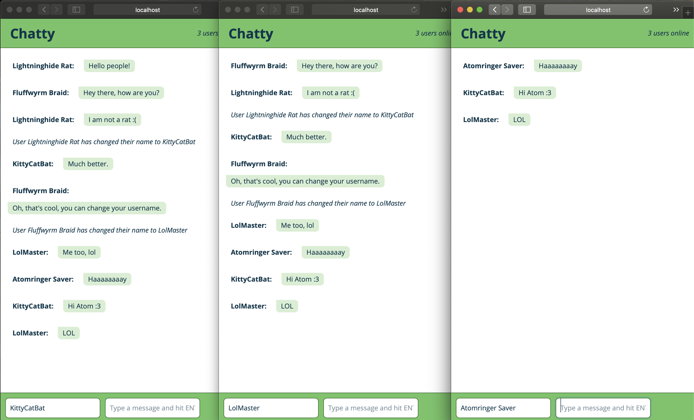

ChattyApp
=====================

**A single page chat application built with react for a lighthouse labs bootcamp project.**

#### Features:
* Real time instant messaging
* Randomly generates silly usename for each new user, until...
* User may set their own custom username (using 'Enter' or 'Tab')
* Notifies other users when username is updated
* currently online user count

### Start Me Up!

1. Clone this repo: `git clone https://github.com/GhabeBossin/ChattyApp chatty`
2. run `npm install` in that directory to install all dependencies
3. run `npm run socket`, then `npm start`
4. then navigate to http://localhost:3000 in your browser.

### Dependencies

* React
* Webpack
* Webpack
* Babel
* node/node-sass/sass-loader/css-loader
* uuid/v1
* Express.js
* Node.js
* Sillyname